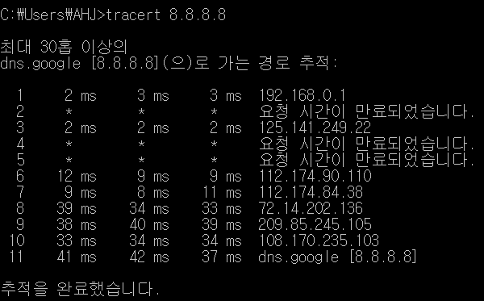
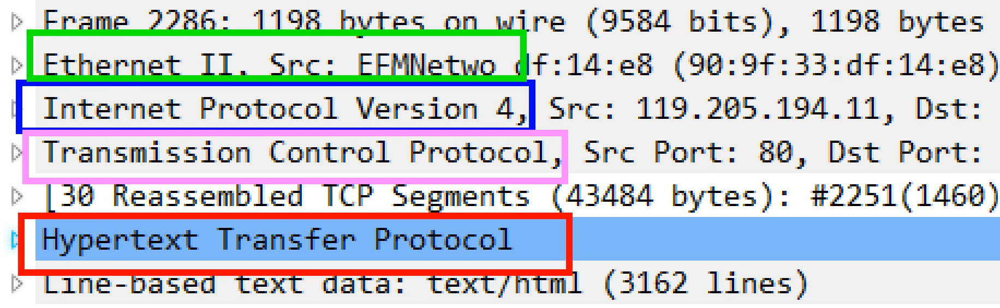
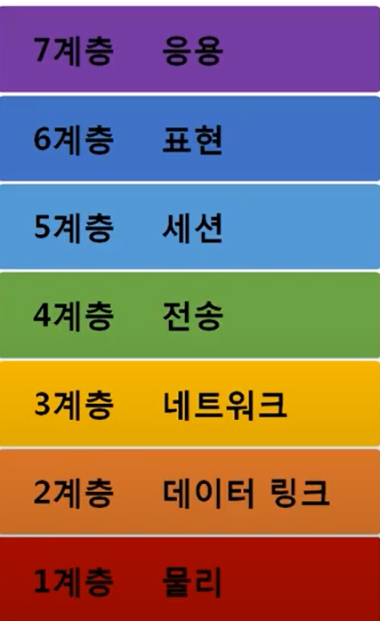
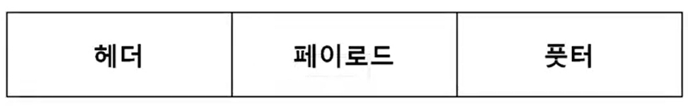
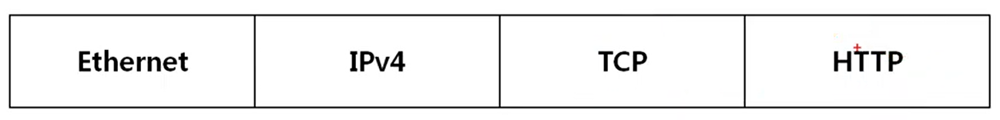

전체영상: [네트워크 기초(개정판)](https://www.youtube.com/playlist?list=PL0d8NnikouEWcF1jJueLdjRIC4HsUlULi)

### [네트워크란?](https://youtu.be/Av9UFzl_wis?list=PL0d8NnikouEWcF1jJueLdjRIC4HsUlULi)

- `노드`(간단히는 컴퓨터)들이 데이터를 공유할 수 있게 하는 디지털 전기통신망의 하나.

- 분산되어 있는 컴퓨터를 통신망으로 연결한 것.

- 네트워크에서 여러 장치들은 노드 간 연결을 사용하여 서로에게 데이터를 교환.

인터넷: 전세계 통신망 중 가장 큰 네트워크 통신망

cf) www(World Wide Web): 인터넷을 `이용`하는 하나의 서비스 - 흔히 인터넷과 착각

-> 이런 네트워크를 나누는 기준?

#### 분류

- 크기

  - LAN(Local Area Network)  
    가까운 거리만 연결

  - WAN(Wide Area Network)  
    먼 지역 연결  
    여러 개의 LAN을 하나로 묶은 것

  - MAN(Metropolitan Area Network)

  - VLAN, CAN, PAN ...

- 연결 형태(Topology)

  - Star  
    중앙 장비에 모든 노드가 연결. 주로 LAN  
    문제점: 중앙 장비가 고장난다면?

  - Mesh  
    여러 노드가 서로 그물처럼 연결된 것. 주로 WAN

  - Hybrid  
    ex. 여러 Star형의 LAN들이 Mesh 형태의 WAN으로 연결되어 있는 것

  - Tree, Ring, Bus

-> 분류는 알겠는데, 노드끼리 어떻게 통신하는가?

#### 통신 방식

- 유니 캐스트(Uni-Cast)  
  가장 많이 사용  
  여러 사용자 중 특정 대상만 통신(1:1 통신)

- 멀티 캐스트(Multi-Cast)  
  여러 사용자 중 특정 다수와 통신(1:N 통신)

- 브로드 캐스트(Broad-Cast)  
  `같은 네트워크` 내 `모든` 대상과 통신(1:N 통신)

-> 어떻게 특정 사용자를 선택할 수 있을까?

#### 프로토콜(Protocol)

일종의 약속, 양식.  
택배 보내기 위한 양식, 문자 보내기 위한 양식이 있듯이 분류, 방식, 목적 따라서 프로토콜도 달라진다.

목적 예시: 네트워크 주소 알고 싶다. 인터넷 하고 싶다. 파일 공유만 하고 싶다. 등

- 가까운 곳과 연락

  Ethernet 프로토콜: MAC 주소 사용

- 멀리 있는 곳과 연락

  ICMP, IPv4, ARP 프로토콜: IP 주소 사용

- 특정 프로그램과 연락

  TCP, UDP 프로토콜: Port 번호(주소) 사용

통신을 위해서 즉, 데이터를 전송하기 위해서는 여러 프로토콜로 특정 주소를 찾아가야함

패킷: 하나의 데이터를 여러 프로토콜로 감싼 `캡슐화` 된 것

ex. 하나의 데이터를 어떤 프로그램(TCP, Port)인지, 어느 지역(IPv4, IP)인지, 어떤 구체적 컴퓨터(Ethernet, MAC)인지 찾아가도록 여러 프로토콜 함께 사용

### [실습1 (tracert)](https://youtu.be/paJf7JbBWqY?list=PL0d8NnikouEWcF1jJueLdjRIC4HsUlULi)

- cmd 창 열고 tracert 8.8.8.8

tracert : TRACE RouTe => 네트워크 길목을 쫓아가주는 프로그램

8.8.8.8: 구글 DNS IP 주소

- 내 컴퓨터에서 구글까지 찾아갈 때 11개의 네트워크를 거쳐갔다. 홉 바이 홉

홉: 몇개의 네트워크를 넘어갔냐

### [실습2 (Wireshark)](https://youtu.be/vBrQ3yzerMg?list=PL0d8NnikouEWcF1jJueLdjRIC4HsUlULi)

- 실제 네트워크 내 패킷 확인

### [네트워크 모델](https://youtu.be/y9nlT52SAcg?list=PL0d8NnikouEWcF1jJueLdjRIC4HsUlULi)

- TCP/IP 모델  
  1960년 대 말 시작 4계층  
  네트워크 패킷은 TCP/IP 모델이 더 잘맞긴 함  
  4계층 응용  
  3계층 전송  
  2계층 네트워크  
  1계층 네트워크 인터페이스
- OSI 7계층  
   좀 더 중요. 네트워크 표준  
   데이터 주고 받을 때 흐름을 각 구간으로 나눠 놓은 것  
   

이것만은 내부 구조까지도 꼭 알자!  
7계층 - HTTP  
4계층 - TCP, UDP  
3계층 - ICMP, IP, ARP  
2계층 - Ethernet

**공통점**

- 계층적 네트워크
- 계층간 역할 정의

**차이점**

- 계층 수 차이
- TCP/IP - 프로토콜 기반, 실무적 느낌
  OSI - 역할 기반, 논리적 느낌
- TCP/IP - 데이터 전송기술 특화
  OSI - 통신 전반 표준

사실 HTTP만 해도 표현(6계층), 세션(5계층) 내용도 포함하는 경우가 많다.

#### 패킷

네트워크를 통해 전달되는 데이터. 하나의 `블록` 단위

여러 제어 정보 + 사용자 데이터(payload)로 구성

마트료시카 인형에서 작은 인형이 큰 인형에 들어가야하는 것처럼 `패킷 프로토콜도 순서가 있다`!

패킷 구성도

페이로드: 실질적으로 보내려하는 데이터

헤더, 풋터가 붙을 수 있음. but 풋터 잘 사용하지 않음. 주로 헤더 사용

> 
> HTTP 프로토콜을 payload로 TCP 프로토콜을 헤더로 붙임 ⇒ 하나의 packet  
> 이 packet을 payload로 다시 IPv4 프로토콜 헤더를 붙임 ⇒ 하나의 packet  
> 이 packet을 payload로 다시 Ethernet 프로토콜 헤더를 붙임 ⇒ 하나의 packet

---

**`캡슐화(Encapsulation)`** : 보낼 때

패킷을 붙이는 과정. 이 과정은 상위 계층에서 하위 계층으로 내려가면서 프로토콜을 붙인다. 하위 프로토콜 앞에 상위 프로토콜이 붙을 수 없다. 같은 계층 프로토콜이 헤더로 붙을 수는 있다.

**`디캡슐화(Decapsulation)`** : 받을 때

받은 패킷을 확인하는 과정. 하위 프로토콜부터 하나씩 양식대로 데이터를 확인하는 것. 2계층 확인 → 3계층 확인 → 4계층 확인 → 데이터 확인. 이런 식으로

이더넷 확인 시 Ethernet 헤더 이외에는 전부(IP, TCP, 데이터) 그냥 payload임.

**`PDU(Protocol Data Unit)`**

각 계층 마다 이런 패킷의 모양이 다르기 때문에 각 패킷을 부르는 이름이 다름.

4계층 PDU : Segment

3계층 PDU : Packet

2계층 PDU : Frame

패킷에서 footer는 잘 사용되지 않지만 Ethernet 프로토콜에서는 사용되기도

> ex. ARP 프로토콜 전송 할 때
>
> 헤더 : Ethernet  
> 페이로드 : ARP(ARP+데이터) → 여기에서 보내는 데이터가 없음
>
> [eth] - [arp] - [footer]
